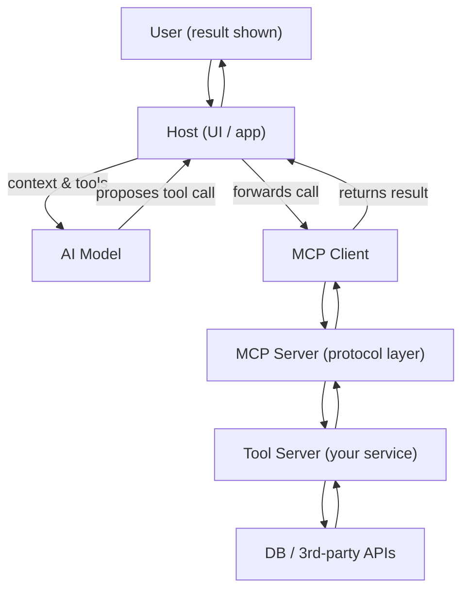

# MCP: Model Context Protocol

> A simple, practical way for an AI-driven app to call your backend functions (tools).

Created by Anthropic: <https://www.anthropic.com/index/mcp>

## What is MCP

- An AI by itself can only **read and write text**
- It cannot:
  - check a database
  - call an API
  - reserve a table
  - change real data
- MCP is how text-only models safely trigger real actions

---

## What Is the MCP Server

- The **MCP Server** is a process or service you run.
- It exposes tools/resources/prompts over the MCP protocol.
- It maps a tool name + arguments to real code you control.
- It returns structured outputs (and errors) back to the client.
- It can run locally next to the host or remotely on a server.

## What is a “tool”

- A **tool** is just a **function** the AI is allowed to use
- Same thing you already know:
  - a backend function
  - an API endpoint
  - a script

Example:

- `reserve_table(date, time, people, name)`
- `list_available_slots(date, people)`

---

## What Is the Host

- The **Host** is the user-facing app that runs the AI.
- It decides **which MCP servers are allowed** for this user or session.
- It sends the AI:
  - the user’s question
  - the available tools

- **The Host is the security boundary**
  - approves or rejects tool calls
  - controls consent and permissions
- It puts tool results back into the conversation so the AI can continue.

Examples:

- Copilot in VS Code
- ChatGPT desktop app
- Claude desktop app

---

## What Is the MCP Client

- The **MCP Client** is the Host’s connection to **one MCP server**.
- It is created by the Host when it connects to a server.
- It is responsible for:
  - fetching the list of tools from the server
  - sending tool calls
  - receiving results

Think of it as:

> a thin adapter between the Host and one backend service

---

## Important: MCP Server ≠ AI

- Runs backend code
- Defines tools
- Returns structured results
- Never talks to users
- Never decides what to call

---

## Host + Client + Server

- One **Host** can connect to many MCP servers.
- For each server, the Host creates **one MCP client**.
- Each MCP client talks to **exactly one server**.
- The Host can:
  - call tools from multiple servers
  - combine their results
  - enforce rules per server and per tool

---

## Why MCP Exists

- Each AI app uses a different way to define tools.
- Each AI app uses a different way to call functions.
- Error handling is different everywhere.
- You rewrite the same adapter logic again and again.
- Changing AI apps means rewriting integrations.

With MCP:

- Tool definitions are standard.
- Tool calls are standard.
- Switching hosts is mostly configuration.

---

## Real Life Example: Restaurant Reservation

### The system already exists

- Database of tables
- Reservation logic
- Business rules (opening hours, capacity)

You expose parts of it via MCP.

---

### Tools you expose

- `list_available_slots(date, people)`
- `reserve_table(date, time, people, name)`
- `cancel_reservation(reservation_id)`

Each tool = one backend function.

---

### What the AI can now do

- Ask: “Any tables for 2 at 7pm?”
- AI calls `list_available_slots`
- User says “book it”
- AI calls `reserve_table`
- Real reservation is created

---

## What the AI Sees

The AI does **not** see your database
The AI does **not** see your code

It only sees:

- tool names
- input fields
- which fields are required

This is called a **tool schema**

---

## Tool Schema

A schema is just:

- function name
- arguments
- types

Same idea as:

- TypeScript types
- function signatures

Conceptual Example:

- `reserve_table`
  - `date: string`
  - `time: string`
  - `people: number`
  - `name: string`

---

## Why Schemas Matter

If schema is good:

- AI knows when to use the tool
- AI sends correct arguments

If schema is bad:

- AI calls wrong tool
- AI sends wrong fields
- Tool fails

---

## Who Calls the Tool

- AI **does not** execute code
- AI only **asks** to call a tool

The **Host**:

- receives the request
- decides if it is allowed
- routes the call via an MCP client to an MCP server
- the MCP server runs the real code and returns the result

---

## The Call Flow (Concrete)

1. User: “Book a table for 2 at 7pm”
2. AI: “I should call `reserve_table`”
3. Host: sends a tool call via the MCP client
4. MCP server: runs real code
5. Result: reservation id returned
6. AI: explains result to user

---

## What MCP Actually Standardizes

MCP standardizes:

- how tools are listed, described and discovered
- how tools are called
- how schemas are sent
- how calls are made
- how results come back

MCP does **not** standardize:

- business logic
- database design
- permissions
- UI

---

## What MCP Lets You Do in Practice

- You can connect the same backend to different AI apps.
- Your backend does not care whether the caller is:
  - ChatGPT
  - VS Code
  - some internal tool
- Adding a new backend does not break existing ones.
- You can deploy backend services independently from the AI app.
- You can split a big system into small, focused tool servers:
  - reservations
  - billing
  - analytics

---

## MCP Is Not Magic (Real Problems)

### Tool Lists Grow Fast

- Real systems end up with **dozens or hundreds of tools**.
- The AI must see many tools it will never use.
- This makes reasoning slower and more error-prone.

### Permissions Don’t Go Away

- MCP does **not** solve security for you.
- You still must decide:
  - which tools are allowed
  - when the AI is allowed to call them
  - what needs user confirmation

### Debugging Is Hard

- When something breaks, it’s unclear **where**:
  - AI chose the wrong tool?
  - arguments were wrong?
  - backend failed?

- Logs are spread across:
  - host
  - MCP client
  - MCP server

### Latency Adds Up

- Each tool call is a **network hop**.
- Multi-step tasks can feel slow:
  - plan
  - call
  - read result
  - call again

### Where Tokens Go

- Hosts often resend **the same tool schemas** again and again.
- Tool schemas can be **longer than the user question**.
- Tools often return **raw database rows**, not summaries.
- Multiple servers repeat similar context.
- Multi-step tool use adds planning + explanation tokens.

#### Why This Happens

- The model needs enough detail to avoid invalid calls.
- Many hosts do not cache tool metadata.
- Backends expose **generic “do everything” tools**.
- Returning “everything” feels safer than missing data.
- Safety and auditing add extra text automatically.

---

## MCP Call Flow

- Context & tools: The Host sends the user question along with available tool schemas to the AI model.
- Proposes tool call: The AI model analyzes the context and suggests which tool to call with specific arguments.
- Forwards call: The Host receives the proposed tool call and forwards it to the MCP Client.
- MCP Client to MCP Server: The MCP Client sends the tool call request to the MCP Server using the MCP protocol.
- Tool Server: The MCP Server forwards the request to the actual Tool Server, which contains the business logic.
- DB / 3rd-party APIs: The Tool Server interacts with databases or third-party APIs to execute the requested operation.
- Returns result: The result is sent back through the MCP Server and MCP Client to the Host.
- User (result shown): Finally, the Host displays the result to the user in the UI/app.

---

## MCP Trade-off

- MCP makes tool calling **standard and reusable**
- It does **not** make it:
  - cheap
  - simple
  - automatic

You still design:

- good tools
- good schemas
- good boundaries
